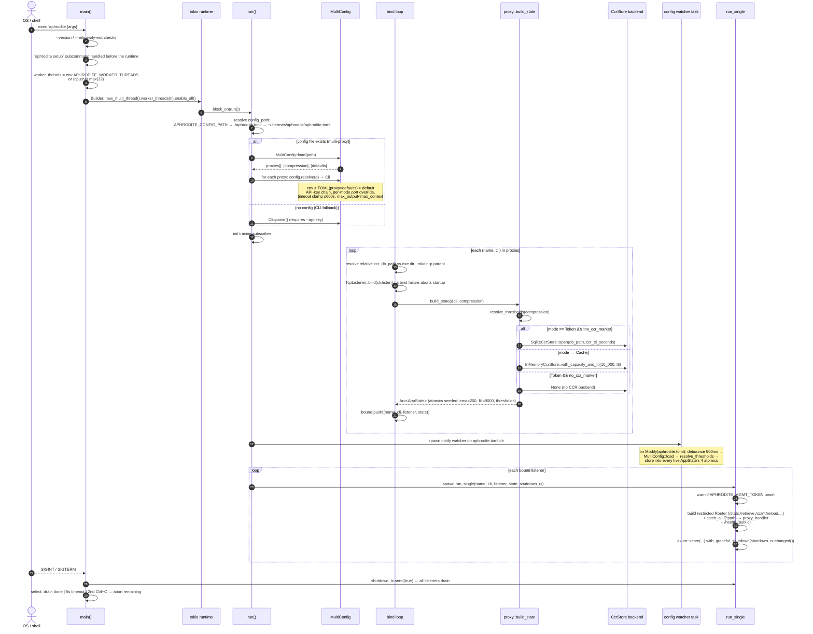
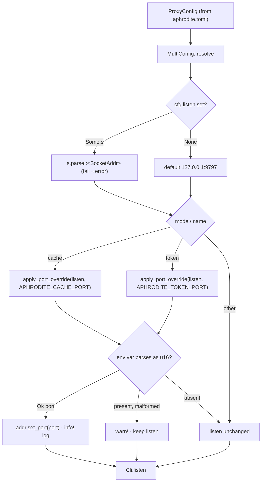

# Process Startup & Dual-Proxy Launch

`aphrodite` startup splits into two halves. The binary half resolves configuration (env > TOML > default), binds every listener before spawning any server, builds one `AppState` per listener with a CCR store backend, and arms a config-file reload watcher. The Hermes plugin half runs once per Hermes home inside `register()`: it loads and smoke-tests the dylib, checks the runtime layout (report-only), materializes the built-in directives, registers hooks and tools, and launches the proxy when it is not already healthy.

## Startup sequence



## Port override (env pierces TOML per mode)



## Plugin startup (register() - the Hermes-side half)

`register()` runs once per Hermes home (one `PluginManager` per home) and is a **pure loader**: all logic lives in the dylib. Runtime artifacts (binary, dylib, `aphrodite.toml`, `ccr.db`, logs) live under the canonical runtime home `$HERMES_HOME/aphrodite` (else `~/.hermes/aphrodite`), never inside the plugin tree.

```mermaid
sequenceDiagram
    autonumber
    participant H as Hermes host (PluginManager)
    participant R as register()
    participant DL as _load_dylib
    participant PR as _probe_dylib (subprocess)
    participant LH as layout_check.check_and_heal
    participant MD as aphrodite_hermes_materialize_directives
    participant GH as aphrodite_hermes_get_hooks / get_schemas
    participant SP as _start_proxy

    H->>R: register(ctx)
    R->>DL: _load_dylib()
    DL->>DL: _ensure_binaries(): presence check - NEVER downloads<br/>missing → log explicit setup command (download.sh / aphrodite setup);<br/>legacy APHRODITE_AUTO_DOWNLOAD=1 opt-in runs download.sh
    DL->>PR: subprocess smoke-test (once per unique path)
    PR-->>DL: rc==0 → CDLL on the resolved canonical path (once per process, no hot-reload)
    DL->>DL: _configure_ffi: _bindings.py bind_to → manual fallback →<br/>_REQUIRED_VOID_P assertion
    R->>LH: check_and_heal() (best-effort, never raises)
    Note over LH: canonical layout per layout_schema.json v2 (report-only):<br/>detect + log deviations, quarantine stale plugin-source copies;<br/>never moves in a git checkout, never touches plugins/aphrodite (Hermes-owned)
    R->>MD: materialize_directives(home_dir=b"")
    MD-->>R: {"status":"ok","written":[...],"skipped":[...],"warnings":[...]}
    Note over MD: embeds the built-in directives from the binary<br/>(include_str!) → writes ~/.hermes/aphrodite/directives/<br/>idempotent, never overwrites user-modified files
    R->>GH: hooks[] + schemas[]
    loop each hook (per-hook try/except - one failure never aborts)
        R->>R: ctx.register_hook(name, _hook_dispatch) (fresh dylib per call)
    end
    loop each tool (per-tool try/except)
        R->>R: ctx.register_tool(name, "aphrodite", schema, _make_handler(name))
    end
    Note over R: skills are not shipped - they live dev-side<br/>context engine is opt-in (APHRODITE_CONTEXT_ENGINE=1)
    R->>SP: _start_proxy()
    SP->>SP: pre-launch probe: GET /health on :9797/:9798<br/>(direct-only opener, confirmed "healthy" body) → reuse running instance?
    alt both healthy
        SP->>SP: skip launch
    else launch needed
        SP->>SP: Popen(aphrodite binary) · stderr → ~/.hermes/aphrodite/proxy-stderr.log
        SP->>SP: immediate-death check (stderr tail + API-key hint) ·<br/>poll both health endpoints ≤5s
    end
```

The layout check and the directives materialize are best-effort by design: either failing degrades to a warning and the plugin still registers (never a raise). The dylib load itself is the one hard gate - if the smoke test or the FFI assertion fails, `register()` logs "plugin disabled" and returns.

## Call sites

| Concern                                                               | Module                                                                        |
| --------------------------------------------------------------------- | ----------------------------------------------------------------------------- |
| Runtime + subcommand dispatch                                         | `crates/aphrodite/src/main.rs`                                                |
| Config path resolution + bind-before-spawn                            | `crates/aphrodite/src/main.rs`                                                |
| Config reload watcher                                                 | `crates/aphrodite/src/main.rs`                                                |
| Per-listener router + serve                                           | `crates/aphrodite/src/main.rs`                                                |
| `MultiConfig::resolve` / `apply_port_override`                        | `crates/aphrodite/src/config/`                                                |
| `proxy::build_state` (CCR backend selection)                          | `crates/aphrodite/src/proxy.rs`                                               |
| `resolve_thresholds`                                                  | `crates/aphrodite/src/proxy.rs`                                               |
| `SqliteCcrStore` / `InMemoryCcrStore`                                 | `vendor/headroom/crates/headroom-core/src/ccr/backends/{sqlite,in_memory}.rs` |
| Plugin `register()` / `_load_dylib` / `_probe_dylib` / `_start_proxy` | `plugins/aphrodite/__init__.py`                                               |
| Layout check (report-only)                                            | `plugins/aphrodite/layout_check.py` (+ `layout_schema.json`)                  |
| Directives materialize FFI                                            | `crates/aphrodite-hermes/src/lib.rs`                                          |
